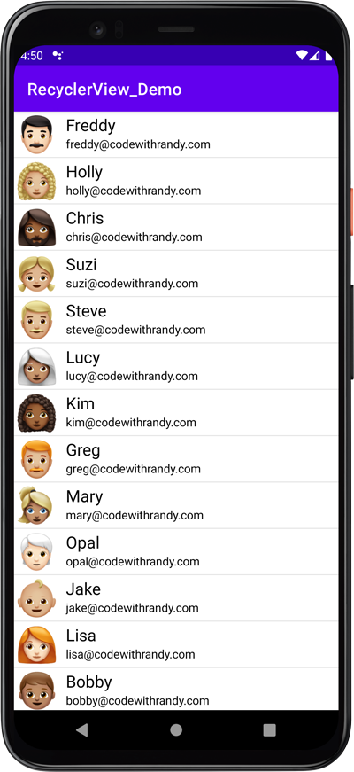

# RecyclerView Demo

How to implement a recyclerview in Android Studio with Java

## YouTube Tutorial

I haven't made a video tutorial for this project yet. Subscribe to my channel to get updated if I do. https://bit.ly/3MBVF1E

## Project Info

Basic framework for populating a recyclerview from a list of items. I tried to keep it as simple as possible for reusability. 
It can be easily modified for your project or simply used to learn how to implement a recyclerview with Java. 
Project files that you will want to study include the following ::

- MainActivity.java
- adapter / ItemAdapter.java
- model / Item.java
- res / layout / item_view.xml
- res / layout / activity_main.xml
- res / drawable / a.png .. .. m.png

## Screenshot

